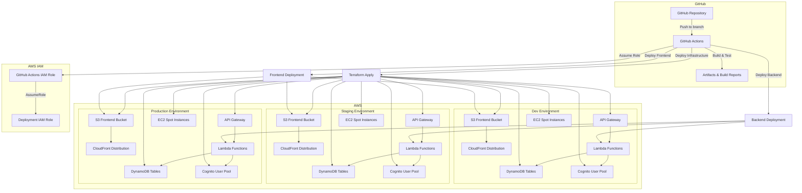
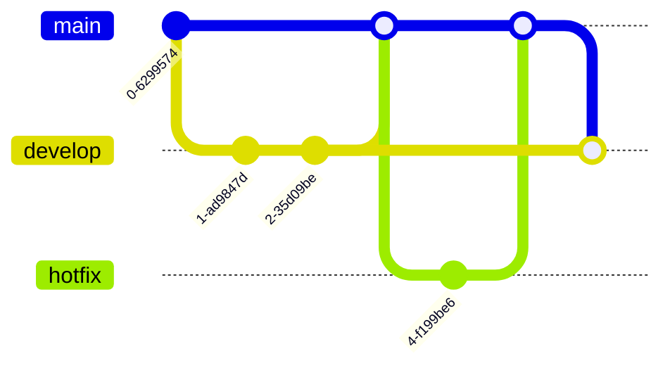

# GitHub Actions and AWS Deployment Strategy for aws-gpu-spot-monitor

This document outlines a comprehensive deployment strategy for the aws-gpu-spot-monitor project, focusing on cost optimization and security while being streamlined for a single developer making frequent large changes.

## Table of Contents

1. [High-Level Architecture](#1-high-level-architecture)
2. [Required AWS IAM Permissions and Resources](#2-required-aws-iam-permissions-and-resources)
3. [Recommended Branching Strategy](#3-recommended-branching-strategy)
4. [CI/CD Workflow Stages](#4-cicd-workflow-stages)
5. [Security Considerations for AWS Credentials](#5-security-considerations-for-aws-credentials)
6. [Cost Optimization Strategies](#6-cost-optimization-strategies)
7. [Implementation Plan](#7-implementation-plan)

## 1. High-Level Architecture

The deployment architecture connects GitHub Actions to AWS services across three environments (dev, staging, production):



## 2. Required AWS IAM Permissions and Resources

### 2.1 GitHub Actions IAM Role

Create a dedicated IAM role for GitHub Actions with the following trust relationship:

```json
{
  "Version": "2012-10-17",
  "Statement": [
    {
      "Effect": "Allow",
      "Principal": {
        "Federated": "arn:aws:iam::<AWS_ACCOUNT_ID>:oidc-provider/token.actions.githubusercontent.com"
      },
      "Action": "sts:AssumeRoleWithWebIdentity",
      "Condition": {
        "StringEquals": {
          "token.actions.githubusercontent.com:aud": "sts.amazonaws.com"
        },
        "StringLike": {
          "token.actions.githubusercontent.com:sub": "repo:<GITHUB_USERNAME>/aws-gpu-spot-monitor:*"
        }
      }
    }
  ]
}
```

### 2.2 Environment-Specific Deployment Roles

Create three deployment roles with appropriate permissions for each environment:

1. **Dev Deployment Role**:
   - Full permissions for dev environment resources
   - Terraform state management permissions

2. **Staging Deployment Role**:
   - Full permissions for staging environment resources
   - Terraform state management permissions

3. **Production Deployment Role**:
   - Full permissions for production environment resources
   - Terraform state management permissions

### 2.3 Required IAM Policies

#### Terraform State Management Policy
```json
{
  "Version": "2012-10-17",
  "Statement": [
    {
      "Effect": "Allow",
      "Action": [
        "s3:ListBucket",
        "s3:GetObject",
        "s3:PutObject",
        "s3:DeleteObject"
      ],
      "Resource": [
        "arn:aws:s3:::aws-gpu-spot-monitor-terraform-state-<ENV>",
        "arn:aws:s3:::aws-gpu-spot-monitor-terraform-state-<ENV>/*"
      ]
    },
    {
      "Effect": "Allow",
      "Action": [
        "dynamodb:GetItem",
        "dynamodb:PutItem",
        "dynamodb:DeleteItem"
      ],
      "Resource": "arn:aws:dynamodb:<REGION>:<AWS_ACCOUNT_ID>:table/aws-gpu-spot-monitor-terraform-state-lock-<ENV>"
    }
  ]
}
```

#### Resource Deployment Policy
```json
{
  "Version": "2012-10-17",
  "Statement": [
    {
      "Effect": "Allow",
      "Action": [
        "lambda:*",
        "apigateway:*",
        "dynamodb:*",
        "cognito-idp:*",
        "s3:*",
        "cloudfront:*",
        "cloudwatch:*",
        "logs:*",
        "ec2:*",
        "iam:PassRole",
        "kms:*"
      ],
      "Resource": [
        "arn:aws:lambda:<REGION>:<AWS_ACCOUNT_ID>:function:aws-gpu-spot-monitor-<ENV>-*",
        "arn:aws:apigateway:<REGION>::/restapis/*",
        "arn:aws:dynamodb:<REGION>:<AWS_ACCOUNT_ID>:table/aws-gpu-spot-monitor-<ENV>-*",
        "arn:aws:cognito-idp:<REGION>:<AWS_ACCOUNT_ID>:userpool/*",
        "arn:aws:s3:::aws-gpu-spot-monitor-<ENV>-*",
        "arn:aws:cloudfront::<AWS_ACCOUNT_ID>:distribution/*",
        "arn:aws:cloudwatch:<REGION>:<AWS_ACCOUNT_ID>:*",
        "arn:aws:logs:<REGION>:<AWS_ACCOUNT_ID>:log-group:/aws/lambda/aws-gpu-spot-monitor-<ENV>-*",
        "arn:aws:ec2:<REGION>:<AWS_ACCOUNT_ID>:*",
        "arn:aws:iam::<AWS_ACCOUNT_ID>:role/aws-gpu-spot-monitor-<ENV>-*",
        "arn:aws:kms:<REGION>:<AWS_ACCOUNT_ID>:key/*"
      ]
    }
  ]
}
```

## 3. Recommended Branching Strategy

For a single developer making frequent large changes, a simplified but effective branching strategy is recommended:



### 3.1 Branch Structure

1. **`develop`**: 
   - Primary development branch
   - Deploys automatically to the dev environment
   - All new features and non-urgent fixes go here

2. **`main`**:
   - Stable code branch
   - Deploys to staging automatically
   - Deploys to production with manual approval
   - Represents what's in production

3. **`hotfix/*`**:
   - Created from `main` for urgent production fixes
   - Merges back to both `main` and `develop`
   - Deploys to dev automatically, staging with approval

### 3.2 Workflow for Single Developer

1. Do daily development work on the `develop` branch
2. When features are complete and tested in dev, merge to `main`
3. Review changes in staging environment
4. Approve production deployment when ready
5. For urgent fixes, create a `hotfix` branch from `main`

## 4. CI/CD Workflow Stages

### 4.1 Infrastructure Workflow

```yaml
name: Infrastructure Deployment

on:
  push:
    branches: [develop, main]
    paths:
      - 'terraform/**'
  workflow_dispatch:
    inputs:
      environment:
        description: 'Environment to deploy to'
        required: true
        default: 'dev'
        type: choice
        options:
          - dev
          - staging
          - prod

jobs:
  determine_environment:
    runs-on: ubuntu-latest
    outputs:
      environment: ${{ steps.set-env.outputs.environment }}
    steps:
      - id: set-env
        run: |
          if [ "${{ github.event_name }}" == "workflow_dispatch" ]; then
            echo "environment=${{ github.event.inputs.environment }}" >> $GITHUB_OUTPUT
          elif [ "${{ github.ref }}" == "refs/heads/main" ]; then
            echo "environment=staging" >> $GITHUB_OUTPUT
          else
            echo "environment=dev" >> $GITHUB_OUTPUT
          fi

  terraform:
    needs: determine_environment
    runs-on: ubuntu-latest
    environment: ${{ needs.determine_environment.outputs.environment }}
    
    steps:
      - uses: actions/checkout@v4
      
      - name: Configure AWS Credentials
        uses: aws-actions/configure-aws-credentials@v4
        with:
          role-to-assume: arn:aws:iam::${{ secrets.AWS_ACCOUNT_ID }}:role/github-actions-${{ needs.determine_environment.outputs.environment }}-role
          aws-region: ${{ secrets.AWS_REGION }}
          
      - name: Setup Terraform
        uses: hashicorp/setup-terraform@v3
        
      - name: Terraform Init
        working-directory: terraform/environments/${{ needs.determine_environment.outputs.environment }}
        run: terraform init
        
      - name: Terraform Plan
        working-directory: terraform/environments/${{ needs.determine_environment.outputs.environment }}
        run: terraform plan -out=tfplan
        
      - name: Terraform Apply
        working-directory: terraform/environments/${{ needs.determine_environment.outputs.environment }}
        run: terraform apply -auto-approve tfplan
```

### 4.2 Backend Workflow

```yaml
name: Backend Deployment

on:
  push:
    branches: [develop, main]
    paths:
      - 'src/**'
      - 'serverless.yml'
      - 'package.json'
      - 'package-lock.json'
  workflow_dispatch:
    inputs:
      environment:
        description: 'Environment to deploy to'
        required: true
        default: 'dev'
        type: choice
        options:
          - dev
          - staging
          - prod

jobs:
  determine_environment:
    runs-on: ubuntu-latest
    outputs:
      environment: ${{ steps.set-env.outputs.environment }}
    steps:
      - id: set-env
        run: |
          if [ "${{ github.event_name }}" == "workflow_dispatch" ]; then
            echo "environment=${{ github.event.inputs.environment }}" >> $GITHUB_OUTPUT
          elif [ "${{ github.ref }}" == "refs/heads/main" ]; then
            echo "environment=staging" >> $GITHUB_OUTPUT
          else
            echo "environment=dev" >> $GITHUB_OUTPUT
          fi

  test:
    runs-on: ubuntu-latest
    steps:
      - uses: actions/checkout@v4
      
      - name: Setup Node.js
        uses: actions/setup-node@v4
        with:
          node-version: '18'
          cache: 'npm'
          
      - name: Install dependencies
        run: npm ci
        
      - name: Run tests
        run: npm test
        
      - name: Run linting
        run: npx eslint src/

  deploy:
    needs: [determine_environment, test]
    runs-on: ubuntu-latest
    environment: ${{ needs.determine_environment.outputs.environment }}
    steps:
      - uses: actions/checkout@v4
      
      - name: Setup Node.js
        uses: actions/setup-node@v4
        with:
          node-version: '18'
          cache: 'npm'
          
      - name: Install dependencies
        run: npm ci
        
      - name: Configure AWS Credentials
        uses: aws-actions/configure-aws-credentials@v4
        with:
          role-to-assume: arn:aws:iam::${{ secrets.AWS_ACCOUNT_ID }}:role/github-actions-${{ needs.determine_environment.outputs.environment }}-role
          aws-region: ${{ secrets.AWS_REGION }}
          
      - name: Deploy with Serverless
        run: npx serverless deploy --stage ${{ needs.determine_environment.outputs.environment }}
        env:
          NODE_ENV: ${{ needs.determine_environment.outputs.environment }}
```

### 4.3 Frontend Workflow

```yaml
name: Frontend Deployment

on:
  push:
    branches: [develop, main]
    paths:
      - 'aws-gpu-spot-monitor/frontend/**'
  workflow_dispatch:
    inputs:
      environment:
        description: 'Environment to deploy to'
        required: true
        default: 'dev'
        type: choice
        options:
          - dev
          - staging
          - prod

jobs:
  determine_environment:
    runs-on: ubuntu-latest
    outputs:
      environment: ${{ steps.set-env.outputs.environment }}
    steps:
      - id: set-env
        run: |
          if [ "${{ github.event_name }}" == "workflow_dispatch" ]; then
            echo "environment=${{ github.event.inputs.environment }}" >> $GITHUB_OUTPUT
          elif [ "${{ github.ref }}" == "refs/heads/main" ]; then
            echo "environment=staging" >> $GITHUB_OUTPUT
          else
            echo "environment=dev" >> $GITHUB_OUTPUT
          fi

  build_and_test:
    runs-on: ubuntu-latest
    steps:
      - uses: actions/checkout@v4
      
      - name: Setup Node.js
        uses: actions/setup-node@v4
        with:
          node-version: '18'
          cache: 'npm'
          cache-dependency-path: 'aws-gpu-spot-monitor/frontend/package-lock.json'
          
      - name: Install dependencies
        working-directory: aws-gpu-spot-monitor/frontend
        run: npm ci
        
      - name: Run tests
        working-directory: aws-gpu-spot-monitor/frontend
        run: npm test -- --watchAll=false
        
      - name: Build
        working-directory: aws-gpu-spot-monitor/frontend
        run: npm run build
        
      - name: Upload build artifact
        uses: actions/upload-artifact@v4
        with:
          name: frontend-build
          path: aws-gpu-spot-monitor/frontend/build

  deploy:
    needs: [determine_environment, build_and_test]
    runs-on: ubuntu-latest
    environment: ${{ needs.determine_environment.outputs.environment }}
    steps:
      - uses: actions/checkout@v4
      
      - name: Download build artifact
        uses: actions/download-artifact@v4
        with:
          name: frontend-build
          path: build
          
      - name: Configure AWS Credentials
        uses: aws-actions/configure-aws-credentials@v4
        with:
          role-to-assume: arn:aws:iam::${{ secrets.AWS_ACCOUNT_ID }}:role/github-actions-${{ needs.determine_environment.outputs.environment }}-role
          aws-region: ${{ secrets.AWS_REGION }}
          
      - name: Deploy to S3
        run: |
          aws s3 sync build/ s3://aws-gpu-spot-monitor-${{ needs.determine_environment.outputs.environment }}-frontend --delete
          
      - name: Invalidate CloudFront cache
        run: |
          DISTRIBUTION_ID=$(aws cloudfront list-distributions --query "DistributionList.Items[?Aliases.Items!=null] | [?contains(Aliases.Items, 'aws-gpu-spot-monitor-${{ needs.determine_environment.outputs.environment }}')].Id" --output text)
          aws cloudfront create-invalidation --distribution-id $DISTRIBUTION_ID --paths "/*"
```

## 5. Security Considerations for AWS Credentials

### 5.1 OIDC Authentication for GitHub Actions

Use OpenID Connect (OIDC) to authenticate GitHub Actions with AWS without storing long-lived credentials:

1. **Setup AWS OIDC Provider**:
   ```terraform
   resource "aws_iam_openid_connect_provider" "github_actions" {
     url             = "https://token.actions.githubusercontent.com"
     client_id_list  = ["sts.amazonaws.com"]
     thumbprint_list = ["6938fd4d98bab03faadb97b34396831e3780aea1"]
   }
   ```

2. **Create IAM Roles with OIDC Trust Relationship**:
   - One role per environment (dev, staging, prod)
   - Restrict by repository and branch conditions

3. **Store Minimal Secrets in GitHub**:
   - `AWS_ACCOUNT_ID`: Your AWS account ID
   - `AWS_REGION`: Default AWS region
   - Environment-specific configuration values

### 5.2 Least Privilege Permissions

1. **Environment Isolation**:
   - Each environment has its own IAM role
   - Production role has stricter permissions
   - Resources are prefixed with environment name

2. **Resource-Level Permissions**:
   - Restrict permissions to specific resources
   - Use ARN patterns with environment variables

3. **Permission Boundaries**:
   - Apply permission boundaries to deployment roles
   - Prevent privilege escalation

### 5.3 Secrets Management

1. **AWS Secrets Manager**:
   - Store sensitive configuration in AWS Secrets Manager
   - Reference secrets in Lambda environment variables
   - Rotate secrets automatically

2. **Environment Variables**:
   - Use GitHub environment secrets
   - Separate secrets per environment
   - Required approvals for production secrets

3. **Terraform State Security**:
   - Encrypt S3 buckets for Terraform state
   - Use DynamoDB for state locking
   - Restrict access to state buckets

## 6. Cost Optimization Strategies

### 6.1 GitHub Actions Cost Optimization

1. **Minimize Build Minutes**:
   - Use caching for dependencies
   - Skip unnecessary steps with path filters
   - Use smaller runner instances when possible

2. **Conditional Workflows**:
   - Only run workflows when relevant files change
   - Skip deployments if no changes detected

3. **Self-hosted Runners**:
   - Consider using self-hosted runners for cost savings
   - Run on spot instances with auto-scaling

### 6.2 AWS Cost Optimization

1. **Lambda Optimization**:
   - Right-size Lambda memory allocation
   - Use provisioned concurrency only when needed
   - Set appropriate timeouts

2. **DynamoDB Optimization**:
   - Use on-demand capacity for dev/staging
   - Consider provisioned capacity for production
   - Enable auto-scaling for provisioned capacity

3. **CloudFront Optimization**:
   - Optimize cache policies
   - Use compression
   - Set appropriate TTLs

4. **S3 Optimization**:
   - Use lifecycle policies to clean up old deployments
   - Enable intelligent tiering for logs

5. **EC2 Spot Instance Optimization**:
   - Diversify instance types
   - Use spot fleet with multiple instance types
   - Implement graceful shutdown handling

## 7. Implementation Plan

### Phase 1: Infrastructure Setup
1. Create Terraform state buckets and DynamoDB tables
2. Set up OIDC provider for GitHub Actions
3. Create IAM roles and policies
4. Configure GitHub repository secrets

### Phase 2: CI/CD Pipeline Implementation
1. Create GitHub Actions workflows
2. Set up environment configurations
3. Configure branch protection rules
4. Test deployment to dev environment

### Phase 3: Environment Configuration
1. Configure dev, staging, and production environments
2. Set up monitoring and alerting
3. Implement logging and observability
4. Test full deployment pipeline

### Phase 4: Documentation and Training
1. Document deployment process
2. Create runbooks for common operations
3. Set up monitoring dashboards
4. Train team members on the deployment process